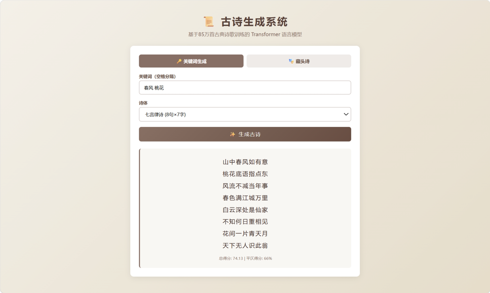
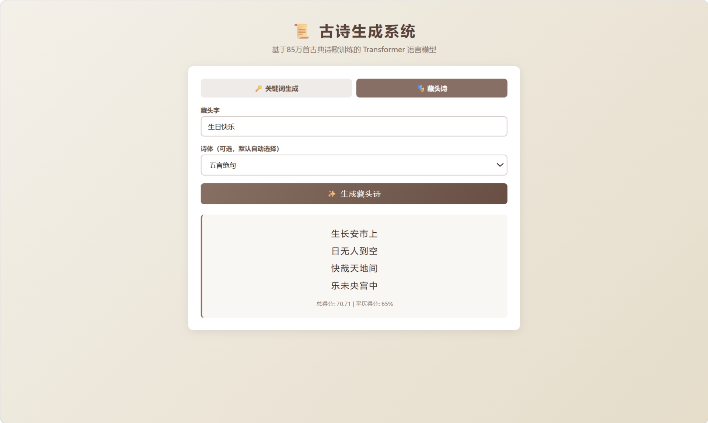

# 古诗生成系统

基于约 85 万首古典诗歌训练的字符级 Transformer 语言模型，支持关键词生成和藏头诗两种模式，并提供命令行与 Flask Web 界面。

## 效果展示

### 关键词生成

输入关键词、选择诗体后生成古诗：



### 藏头诗

输入藏头字，可手动选择诗体或由系统自动选择：



## 功能

- 关键词生成古诗
- 藏头诗生成
- 五言绝句、七言绝句、五言律诗、七言律诗
- Beam Search、温度参数、平仄与押韵约束
- 命令行、交互模式和 Web 界面
- 生成结果质量评分

## 快速开始

### 环境要求

- Python 3.8+
- PyTorch 2.0+

### 安装

```bash
git clone https://github.com/sl-kai/poetry_generate.git
cd poetry_generate
pip install -r requirements.txt
```

仓库已包含生成所需的模型权重、词表、模型配置和统计文件，无须重新训练即可使用。

### Web 界面

```bash
python web_app.py
```

浏览器访问 <http://localhost:5000>。

### 命令行

```bash
# 关键词生成
python main.py keyword --words 春风 桃花 --type 七言律诗

# 藏头诗
python main.py acrostic --head 生日快乐

# 交互模式
python main.py interactive
```

常用参数：

```text
--count        生成候选数量，默认 1
--beam         Beam Search 宽度，默认 15
--temperature  采样温度，默认 0.8
```

## 项目结构

```text
poetry_generate/
|-- assets/screenshots/        # Web 界面截图
|-- data/processed/            # 推理模型与统计文件
|-- src/
|   |-- analyzer.py            # 字频、bigram 与语义共现分析
|   |-- data_loader.py         # 数据清洗与诗体分类
|   |-- generator.py           # 生成、平仄和押韵约束
|   |-- rhyme_dict.py          # 押韵判断
|   |-- tone_dict.py           # 平仄映射与格律模板
|   |-- train_pipeline.py      # 数据预处理流程
|   `-- transformer_model.py   # Transformer 模型
|-- main.py                    # 命令行入口
|-- web_app.py                 # Flask Web 界面
|-- cloud_train.py             # GPU 训练脚本
`-- requirements.txt
```

## 模型与训练数据

仓库保留以下推理文件：

- `transformer_model.pt`：模型权重
- `transformer_model_vocab.json`：字符词表
- `transformer_model_config.json`：模型结构配置
- `statistics.json`：生成评分所需统计数据
- `rhyme_cache.json`：押韵缓存

由于体积较大，原始诗歌 CSV、`all_poems.jsonl` 和 `corpus_all.txt` 未提交。它们只在重新预处理或训练模型时需要，不影响直接生成古诗。

## 依赖

`torch`、`pandas`、`numpy`、`pypinyin`、`tqdm`、`flask`
